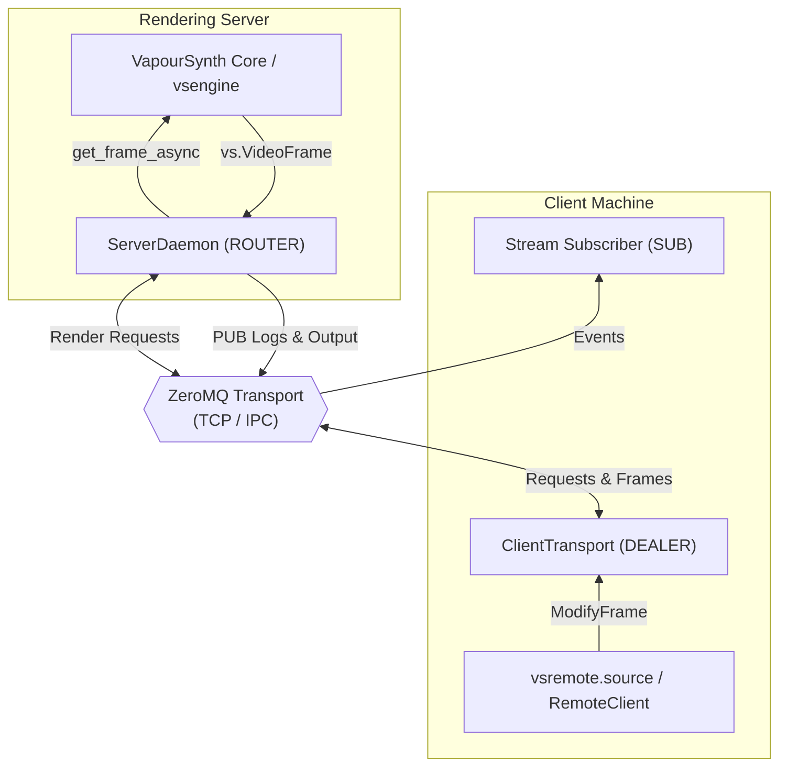

# vs-remote

Remote execution server and frame proxy for VapourSynth.

`vs-remote` runs VapourSynth scripts on a remote machine (e.g. headless server or workstation) and streams frames to a local client for previewing or encoding.

---

## Features

`vs-remote` mirrors remote VapourSynth clips as local `vs.VideoNode` proxies with on-demand streaming and asynchronous frame prefetching. Communication runs over ZeroMQ (`ROUTER`/`DEALER` over TCP or IPC).

Frame planes transfer uncompressed or compressed via Zstandard (`zstd`), with primitive frame properties serialized via MessagePack. Remote `stdout`, `stderr` and logs messages stream directly to the client. Multiple outputs registered with `set_output()` can be listed, named, and consumed independently.

---

## Limitations

- Only `vs.VideoNode` outputs are supported.
- Variable resolution and format clips are not supported.
- Frame property serialization only preserves primitive types (`int`, `float`, `str`, `bytes`, and lists of primitives).

    Non-primitive objects such as embedded `VideoFrame` references (`_Alpha`) fall back to their string `repr()`.

---

## Installation

```bash
uv add vs-remote
```

Or with `pip`:

```bash
pip install vs-remote
```

---

## Quick Start

### 1. Start the Remote Server

On the machine hosting VapourSynth and source media:

```bash
vsremote serve path/to/script.vpy --address tcp://0.0.0.0:5555
```

Or programmatically in Python:

```python
import vsremote

vsremote.serve("script.vpy", address="tcp://0.0.0.0:5555")
```

---

### 2. Connect from the Client

On the local machine:

```python
# client_script.vpy
import vapoursynth as vs
import vsremote

# Mirror output 0 from the remote server
clip = vsremote.source("tcp://192.168.1.100:5555", output=0)

clip.set_output()
```

Open `client_script.vpy` in `vsview`, or pipe directly via the CLI:

```bash
# Preview in vsview
vsview client_script.vpy

# Pipe directly from CLI
vsremote pipe tcp://192.168.1.100:5555 --output 0 | ffmpeg -i - -c:v libx264 out.mp4
```

---

## CLI Reference

`vsremote` provides a CLI for server hosting, diagnostic checks, and pipeline streaming.

| Command  | Description                                           | Example                                                                               |
| :------- | :---------------------------------------------------- | :------------------------------------------------------------------------------------ |
| `serve`  | Host a `.vpy` script or execution server              | `vsremote serve script.vpy --address tcp://0.0.0.0:5555`                              |
| `ping`   | Test connection and measure round-trip latency        | `vsremote ping tcp://192.168.1.100:5555`                                              |
| `info`   | Display metadata for all outputs on the remote server | `vsremote info tcp://192.168.1.100:5555`                                              |
| `pipe`   | Stream frames directly to stdout as Y4M or raw planes | `vsremote pipe tcp://192.168.1.100:5555 --y4m --output 0 \| x265 --y4m - -o out.hevc` |
| `keygen` | Generate a Curve25519 keypair for CurveZMQ encryption | `vsremote keygen`                                                                     |

---

## Python API Reference

### Client API

#### `vsremote.source(...)`

Create a local `vs.VideoNode` proxy mirroring a remote output:

```python
import vsremote

clip = vsremote.source(
    address="tcp://192.168.1.100:5555",
    output=0,
    compression="zstd",  # "zstd" or "none"
    prefetch=4,  # Frames to asynchronously prefetch ahead
    auth_token=None,  # Optional authentication token
    curve_server_key=None,  # Optional CurveZMQ public key
    forward_logs=True,  # Stream remote logs to local logging
)
```

#### `vsremote.RemoteClient`

Client for output introspection, dynamic script loading, and multi-output retrieval:

```python
import vsremote

# Usable as a synchronous or asynchronous context manager
with vsremote.RemoteClient("tcp://192.168.1.100:5555") as client:
    # Introspect available outputs
    outputs = client.list_outputs().result()
    for item in outputs:
        print(f"[{item.index}] {item.name}: {item.info.width}x{item.info.height}")

    # Get proxies for specific or all clips
    clip0 = client.get_output(0)
    all_clips = client.get_outputs()  # dict[int, vs.VideoNode]

    # Dynamic control (requires server started with --allow-eval)
    client.reload().result()  # Reload script from disk
    client.load_script("/path/to/another.vpy").result()  # Switch active script
    client.load_code("import vapoursynth as vs; clip.set_output()").result()
```

---

### Remote Script Authoring API

When authoring `.vpy` scripts served by `vsremote`, use `vsremote.set_output` to register named outputs:

```python
# server_script.vpy
import vapoursynth as vs

from vsremote import is_preview, set_output

core = vs.core

src = core.bs.VideoSource("source.mkv")
noartifact = core.noise.Add(src, var=2000)

# vsremote captures variable names automatically ("src", "noartifact")
# or accepts explicit names: set_output(noartifact, name="Filtered")
set_output(src)
set_output(noartifact)

if is_preview():
    print("Running inside vsremote server environment")
```

---

## Security

The server binds to `127.0.0.1` by default.

Dynamic script loading (`load_script`) and arbitrary code evaluation (`load_code`) are disabled unless the server is started with `--allow-eval`.

Remote connections can be authenticated with a pre-shared token (`--auth-token` or `VSREMOTE_AUTH_TOKEN`) and encrypted using CurveZMQ (Curve25519) keypairs:

```bash
# 1. Generate keypair
vsremote keygen

# 2. Start encrypted and authenticated server
vsremote serve script.vpy --address tcp://0.0.0.0:5555 --curve-secret-key "<SERVER_SECRET_KEY>" --auth-token "my-secret-token"

# 3. Connect client securely
vsremote info tcp://192.168.1.100:5555 --curve-server-key "<SERVER_PUBLIC_KEY>" --auth-token "my-secret-token"
```

---

## Architecture



---

## Notes

This project was developed with the assistance of AI coding tools.
